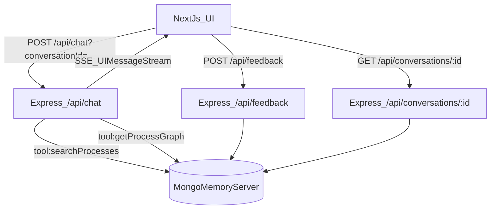

# ARIS Rich Chat Architecture

This document describes the end-to-end architecture of the demo: **Next.js UI + Express streaming backend + AI SDK tool calling + MongoDB (mongodb-memory-server)**, including schemas, chat history, feedback, and how the AI SDK stream protocol drives the rich UI.

## System overview

### What the user experiences

- A normal chat interface.
- When a question is ambiguous, the assistant shows **multiple process candidates** as **action buttons** (cards).
- After choosing a process, the assistant answers grounded in that process’s **steps + connectors**.
- The final grounded answer includes **sources** (what process/elements were used).
- Each final grounded answer supports **feedback** (👍/👎 + optional comment).
- Refreshing the page resumes the conversation, including the selection state and feedback.

### Components

- **Frontend**: Next.js + React (App Router)
  - `app/page.tsx`
  - `components/ProcessCandidates.tsx`
  - `components/MessageFeedback.tsx`
- **Backend**: Node.js + Express
  - `server/index.ts`
- **AI layer**: Vercel AI SDK v6 (`ai`) + Azure OpenAI provider
  - model config: `lib/ai/model.ts`
  - streaming + tools: `streamText()` in `server/index.ts`
- **Database (dev-only)**: `mongodb-memory-server` + `mongodb`
  - bootstrap + indexes: `server/db/mongo.ts`
  - ARIS queries: `server/db/aris.ts`
  - seed helpers: `server/db/seedAris.ts`

---

## Runtime data flow

### High-level flow




### Conversation identity

The UI generates a stable `conversationId` (UUID) and stores it in `localStorage`. All chat requests include it:

- `POST /api/chat?conversationId=<uuid>`

History is fetched with:

- `GET /api/conversations/<uuid>`

### Chat streaming (AI SDK)

The backend uses `streamText()` to produce a **UI message stream** (SSE) that the client consumes through `useChat()`.

Key properties:

- Multi-step tool calling is enabled with `stopWhen: stepCountIs(6)`.
- Tool calls and tool outputs are streamed as UI parts (the UI can render them).
- Sources are attached at the **message metadata** level when the generation finishes.

---

## Database schema

The DB is designed to be Mongo-friendly and flexible for future reporting and migrations.

### ARIS data

#### Collection: `aris_processes`

Fields:

- `processId: string` (unique)
- `name: string`
- `description: string`
- `keywords: string[]`
- `createdAt: Date`
- `updatedAt: Date`

Indexes:

- `{ processId: 1 }` unique
- text index: `{ name: "text", description: "text", keywords: "text" }`

#### Collection: `aris_elements`

Stores both steps and connectors (one collection).

Common fields:

- `elementId: string` (unique)
- `processId: string`
- `type: "step" | "connector"`
- `createdAt: Date`
- `updatedAt: Date`

Step fields:

- `name: string`
- `description?: string`
- `order?: number`
- `lane?: string`

Connector fields:

- `fromStepId: string`
- `toStepId: string`
- `label?: string`
- `condition?: string`

Indexes:

- `{ elementId: 1 }` unique
- `{ processId: 1, type: 1, order: 1 }`

### Chat persistence

#### Collection: `conversations`

- `conversationId: string` (unique)
- `createdAt: Date`
- `updatedAt: Date`

#### Collection: `messages`

Stores UI-message snapshots so the UI can be reconstructed.

- `conversationId: string`
- `uiMessageId: string`
- `role: "user" | "assistant"`
- `parts: unknown[]` (AI SDK UI parts, stored as JSON)
- `metadata?: unknown` (AI SDK metadata, stored as JSON)
- `createdAt: Date`

Notes:

- We store `parts` and `metadata` as JSON to stay forward-compatible with AI SDK changes and avoid frequent migrations.
- We persist only `user` and `assistant` roles.

### Feedback

#### Collection: `feedback`

- `conversationId: string`
- `targetUiMessageId: string` (assistant message id)
- `rating: 1 | -1`
- `comment?: string`
- `createdAt: Date`
- `updatedAt: Date`

Indexes:

- unique compound: `{ conversationId: 1, targetUiMessageId: 1 }`

---

## Seeding ARIS data

### Why seeding is special with mongodb-memory-server

`mongodb-memory-server` is **process-local**. If you seed in one Node process and run the server in another, they will not share data.

### What we do in this demo

- The Express server runs `seedArisIfEmpty()` **on startup** before listening.
- This guarantees `searchProcessesDb()` sees processes even after restarts.

### Seed sources

Fixture files:

- `data/processes.json`
- `data/steps.json`

Seed helper:

- `server/db/seedAris.ts`

Optional script (still useful for validation):

- `npm run seed:aris`

---

## Tool calling + rich UI

### Tool 1: `searchProcesses`

Purpose: find likely ARIS processes for the user question.

Backend implementation:

- `server/db/aris.ts` `searchProcessesDb()`
- Uses `$text` search (and a regex fallback).

Tool output shape (returned to model, streamed to UI as a tool output part):

```json
{
  "type": "process_candidates",
  "candidates": [
    { "processId": "p_card_dispute_chargeback", "title": "...", "shortSummary": "...", "whyMatched": "..." }
  ]
}
```

UI rendering:

- The assistant message contains a part `tool-searchProcesses` with `output-available`.
- `components/ProcessCandidates.tsx` reads that part and renders cards + “Use this process”.

### Tool 2: `getProcessGraph`

Purpose: load the selected process graph for grounding.

Backend implementation:

- `server/db/aris.ts` `getProcessGraphDb(processId)`
- Returns `{ process, steps, connectors }`.

Sources (answer provenance):

- When `getProcessGraph` runs, the backend records `latestAnswerSources`.
- On stream finish, the backend attaches it to the **assistant message metadata**:
  - `metadata.answerSources = { sources: [{ file, ids[] }, ...] }`

UI uses metadata to:

- render Sources panel
- decide whether to show feedback widget

---

## AI SDK “manipulation”: how streaming + tools actually works

### Multi-step execution

The model may call tools before producing a final answer. With:

- `stopWhen: stepCountIs(6)`

the SDK will:

1. Ask the model to generate
2. If a tool call appears, execute the server tool
3. Provide the tool result back to the model in the next step
4. Continue until it produces an answer or stop condition is met

### UI message stream protocol

The backend uses:

- `result.pipeUIMessageStreamToResponse(res, { ... })`

This streams a sequence of UI message chunks over SSE. On the client:

- `useChat()` consumes this and updates `messages` live.

Tool outputs are represented as typed parts:

- `tool-searchProcesses` with `output-available` and `output: {...}`

### Message metadata vs data parts

We attach sources via **metadata** (at finish) instead of streaming a `data-`* part.

Pros:

- Cleanly associated with the assistant message (works well for history replay).
- Easy to show “final message metadata” (sources, tokens, etc.).

Cons:

- It appears at finish, not mid-stream.

---

## Chat history + resume behavior

### History API (joined payload)

Endpoint:

- `GET /api/conversations/:id`

Returns:

- `messages: UIMessage[]`
- `feedbackByMessageId: { [uiMessageId]: { rating, comment?, createdAt } }`

This keeps the UI simple (one fetch).

### Selection “chip” and why the JSON is hidden

To resume correctly, we still send a user message:

```json
{"type":"process_selection","processId":"..."}
```

But the UI hides it from display and uses it to determine the selected process.

On reload:

- `ProcessCandidates` receives `initialSelectedId` derived from the next hidden selection message and collapses to “Selected” state.

---

## Feedback model

### When feedback is shown

Feedback UI appears on assistant messages that contain:

- `message.metadata.answerSources`

This approximates “final grounded answer” messages.

### Feedback write path

- UI posts to `POST /api/feedback` with:
  - `conversationId`
  - `targetUiMessageId` (assistant message id)
  - `rating` (1 or -1)
  - `comment?`

The backend upserts and stores it in `feedback`.

### Feedback read path

History endpoint returns `feedbackByMessageId`, and the UI renders stored feedback in the message.

---

## Operational notes and future changes

### Moving from memory Mongo to real MongoDB

Replace `mongodb-memory-server` with a normal Mongo connection string and keep:

- collections
- indexes
- schemas
- queries

The rest of the system (tools, history join, feedback) stays the same.

### Reporting

Because feedback is stored separately and keyed to assistant message IDs, you can later build analytics such as:

- thumbs-down rate per processId
- frequent complaint clusters from comments
- quality regression by model deployment

